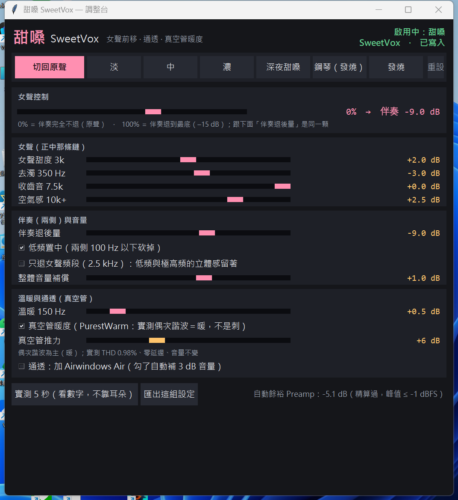

# 甜嗓 SweetVox

聽音樂時把**女聲往前推、伴奏往後退**的 Windows 桌面調音台。
底層用 [Equalizer APO](https://sourceforge.net/projects/equalizerapo/)（系統層等化器）把左右聲道拆成
「正中（通常是人聲）」和「兩側（通常是伴奏）」，各自調整後再無損還原。

## 版本

**V2.0（2026-10-08）**：加入「房間修正」——用一支普通麥克風量出房間低頻的隆起，再用兩顆窄濾波器削掉。
這是整個專案最大的一次改善（實聽評語從「好聽」變成「超好聽」）。
- 新增 `room63`、`room125` 兩顆滑桿（只能削、不能加，左右聲道一起削）；按模式鈕時保留，因為它屬於房間不屬於模式
- `warm`（150 Hz 低頻厚度）可以往下削到 −6 dB；預設 +2.0
- 主畫面精簡：淡／中／濃、伴奏退後量、真空管、Air 外掛的控制項收起來（參數仍在，舊設定照常讀得到）
- 介面多一個「方法論」按鈕，內容同 [`docs/room-measurement.md`](docs/room-measurement.md)
- 新工具：`tools/room_sweep.py`（掃頻量測）、`tools/set_bypass.py`、`tools/set_param.py`

⚠️ 說明檔最上方的截圖還是 09-27 的舊畫面。

### 量你自己的房間

房間修正的數字是**我們那個房間**量出來的，搬到你家不一定對。想量自己的房間，照
[`docs/room-measurement.md`](docs/room-measurement.md) 的八個步驟做。只需要：任何一支麥克風、一個腳架、二十分鐘。
最重要的一句：**兩次量測之間麥克風不能動**，開關一律用 `tools/set_bypass.py` 切。

### 2026-09-27 快照

內容：
- 女聲控制單旋鈕（0～100%，對應兩側退 0～−15 dB）
- 「發燒」模式：只在女聲頻段（2.5 kHz）退兩側，音場保留，THD 0.011%
- 鋼琴（發燒）模式：不動音場、不砍低頻、不加飽和、只衰減，逐位元透明
- 網頁版（`web/sweetvox.js`，Web Audio 同一條鏈）與手機等化曲線產生器（`phone/`）

量測數字與設計取捨寫在 `PLAN.md`，原始量測在 `MEASURE_*.json`。

## 它在做什麼

歌手通常錄在正中間，伴奏分在左右兩邊。甜嗓把兩邊的伴奏調小一點，女聲就會往前、聽得更清楚。
它不是把人聲切出來，只是重新調配比例。

## 聽 YouTube Music 怎麼用

裝好之後（安裝步驟在下面），用 Chrome 聽 YouTube Music，聲音從你選的音效卡出去，就會自動經過甜嗓。

1. 打開 `app/啟動甜嗓.cmd`，跳出上面那個調整台。
2. 播放 YouTube Music。
3. 點最上面一排的模式按鈕，馬上生效，不用重開歌。
4. 想比較有開、沒開的差別，按「切回原聲」，再按一次就換回來。
5. 關掉調整台，效果還會繼續，直到你按「切回原聲」。

### 什麼時候用哪個模式

| 你在聽 | 按這個 | 為什麼 |
|---|---|---|
| 一般女歌手、想自然一點 | **發燒** | 只在人聲那一段頻率（2.5 kHz）把伴奏調小，音樂的寬度、低音都保留，音質最乾淨 |
| 伴奏太吵、聽不清楚歌詞 | **中** 或 **濃** | 伴奏調得更小。濃最明顯，但聲音會變窄，比較像單聲道 |
| 只想輕輕加一點 | **淡** | 伴奏只小一點點 |
| 晚上音量開很小 | **深夜甜嗓** | 音量小的時候，耳朵聽低音和高音會變鈍，這個模式會補回來 |
| 鋼琴、古典、演奏曲 | **鋼琴（發燒）** | 鋼琴的聲音本來就是左右展開的，其他模式會把它壓扁。這個模式不動左右、不動低音，只微調 |
| 男聲、搖滾、電子樂 | **切回原聲** | 這是為女聲調的，其他音樂不一定好聽 |

想精細調整，就拉下面的旋鈕，例如「女聲甜度」「去濁」。拉壞了按「重設」。

### 要注意的地方

- **電腦所有聲音都會被影響**，不只 YouTube Music。看影片、開會，聲音也會跟著變。聽完音樂想恢復，就按「切回原聲」。
- 按「實測 5 秒」可以量出現在女聲比伴奏大多少 dB，不用只靠耳朵判斷。要先放著音樂再按。

## 安裝

要用的東西都在這個倉庫裡，只有 Python 要自己裝。

1. **下載**：按這一頁右上角綠色的 `Code` → `Download ZIP`，解壓縮到任何資料夾。
2. **裝 Equalizer APO**（系統層等化器，甜嗓靠它改聲音）：執行 `installer/EqualizerAPO-x64-1.4.2.exe`。
   安裝途中會跳出裝置清單，**勾你聽音樂用的喇叭或音效卡**，按確定。照提示重新開機。
3. **裝 Python**：到 [python.org](https://www.python.org/downloads/) 下載 3.10 以上，安裝第一個畫面**勾選「Add python.exe to PATH」**。
4. **（選配）** 想用「實測 5 秒」量女聲比伴奏大多少：在解壓縮的資料夾開命令列，打 `pip install -r requirements.txt`。不裝其他功能照常。
5. **開調整台**：雙擊 `app/啟動甜嗓.cmd`，Windows 會問要不要允許修改，按「是」（要寫 Equalizer APO 的設定檔）。

之後每次想用，只要做第 5 步。

### 倉庫裡附了什麼

| 路徑 | 是什麼 | 授權 |
|---|---|---|
| `installer/EqualizerAPO-x64-1.4.2.exe` | Equalizer APO 官方安裝檔，檢查碼與 SourceForge 公布的一致（MD5 `410aab9749ae4673b950bc29a4eb226f`） | GPL-2.0，原始碼在 [SourceForge](https://sourceforge.net/p/equalizerapo/code/) |
| `vst/airwindows/WinVST64s/PurestWarm64.dll` | 「真空管暖度」用的外掛：聲音多一點溫暖的厚度 | MIT（Airwindows，`vst/airwindows/LICENSE.txt`） |
| `vst/airwindows/WinVST64s/Air64.dll` | 「通透：加 Air」用的外掛：高音更亮 | MIT（同上） |

兩個外掛程式會自己找到，不用改路徑。

### 調整台做了什麼

介面把設定寫到 `C:\Program Files\EqualizerAPO\config\sweetvox_custom.txt`，
並在 `config.txt` 加一行 `Include: sweetvox_custom.txt`，即時生效。
想完全停掉：介面按「切回原聲」，或在 `config.txt` 那行前面加 `#`。
`sweetvox_custom.txt`（倉庫根目錄那份）是一份設定範例。

「實測 5 秒」會先找名稱含 `Audiolab` 的音效卡（作者的），找不到就用 Windows 預設喇叭。

## 已知限制

- 「正中＝女聲」是假設。正中央的大鼓、貝斯也會一起往前。
- 伴奏也錄在正中央的老歌，效果會打折。
- 這是重新平衡，不是人聲分離。

## 目錄

| 路徑 | 內容 |
|---|---|
| `app/` | 桌面調音台（Tkinter） |
| `web/` | 網頁版與測試 |
| `phone/` | 手機等化曲線 |
| `tools/` | 量測、驗收、裝置選擇腳本（含房間量測 `room_sweep.py`） |
| `docs/room-measurement.md` | 量房間、修低頻的方法論 |
| `sep/live.py` | 即時人聲分離實驗（模型不附） |
| `installer/` | Equalizer APO 安裝檔 |
| `vst/airwindows/` | 兩個 Airwindows 外掛與授權 |
| `vocal_focus_*.txt` | 第一版三段固定設定（light／med／strong） |

## 授權

MIT
